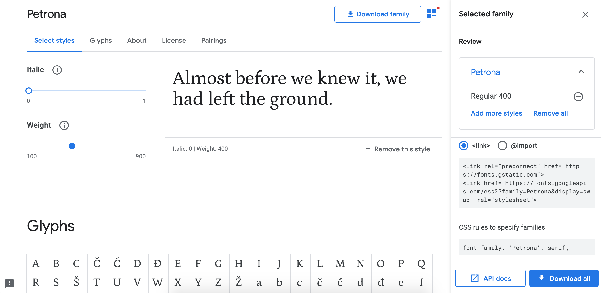

# Fici Sertligi

[Live Demo](https://brutdefut.github.io/ficisertligi/)

## Categories
- blended
- bourbons
- cask-strength
- highland
- islands-peated-smoky
- japan-asia
- lowland-irish
- speyside
- independent

## How to run
- `bundle exec jekyll server`

## How to rename flavor profile names
- flavors are defined in `_includes/flavor-profile.html`
- in `_includes/flavor-profile.html` file, there is an if statement to check all flavors are defined or not.
- If not all flavors are defined, it's not visible in the post. This is good for backward compatible for the posts not updated yet or doesn't want to add flavor.
- in the post pages, you can set score for a flavor, e.g. `smoke_peat : 0`. This is the variable name of flavor.
- flavor varialble name should be in format `xxx_yyy`. Actual flavor name displayed in the website is defined between `
` tags in file `_includes/flavor-profile.html`
- Currently there are 4 flavors defined.
- If you _just_ want to change the display name for a flavor, you can update the flavor name for that flavor in `_includes/flavor-profile.html` file between `
` tags.
- If you want to update flavor variable name, follow these steps;
    - update each flavor variable name `smoke_peat` to `smoke_bitter` in `_includes/flavor-profile.html`
    - update every post's(that has flavors under `_posts` folder) header section with new name, like `smoke_bitter`.
- Best practise is using flavor variable name and display name align to maintain easily for future and also to understand code easily.

### How to update fonts
- in file `_layouts/default.html`, there are 2 `link` lines before `</head>` tag close.
    - update those 2 lines with what google font page offers.
- in file `assets/css/theme.scss`, there are some lines starting with `font-family:`.
    - update those lines with what google font offers under `CSS rules to specify families` section

### How to add a new category
- In the file `_layouts/default.html`, there is a code line for listing categories
    - `<li><a href="{{ site.baseurl }}/categories">Categories</a>`
- Under the categories line, there is a list of categories. You can copy paste of on the line and add yours like;
    - `<li class="sub"><a href="{{ site.baseurl }}/new-category">New Category</a></li>`
    - in the a tag's href section, `new-category` is the url suffix for the category, no uppercase or space should be used, hyphen to separate words. `New Category` wording is the title, will be visible on the website.
- Now, you need to create the `new-category.html` page on the root folder. To do that, copy and paste one of the existing category file like `highland.html`.
    - Rename the copy-paste file with the `new-category.html`
    - Within the `new-category.html` file;
        - update line 2: title to new title what you want. Try to stick to the same wording for less confusion for end users.
        - update line 3: permalink to what you want. Try to stick to the same wording for less confusion for end users.
        - update line 8: Span value to correct title, Capital first letters.
        - update line 14: `` to ``

